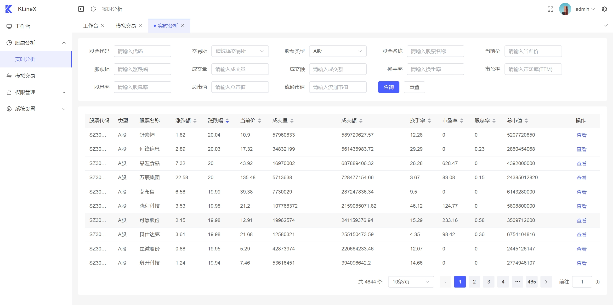
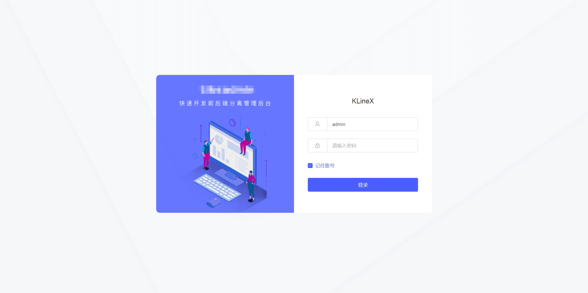

# KLineX

KLineX股票分析系统

使用 laravel 11 开发




## 代码

后端代码: [https://github.com/aa24615/KLineX](https://github.com/aa24615/KLineX)    
前端代码: [https://github.com/aa24615/KLineX-admin](https://github.com/aa24615/KLineX-admin)


后端组件

 |  包名 | 描述 |
|---|---|
|[likeadmin](https://likeadmin.cn/)|管理后台|
| [zyan/stock-api](https://github.com/zyan/stock-api) | 股票API |
| [guanguans/notify](https://github.com/guanguans/notify) | 消息推送 |

前端组件

 |  包名 | 描述 |
|---|---|
|[vue3](https://cn.vuejs.org/)| 框架|
|[element-plus](https://cn.element-plus.org/zh-CN/)|UI|

## 开发计划

#### 2024 搭好框架与数据库

    ...数据采集与入库

#### 2025 做完基本的分析与模拟交易

    ...
    2025-03 数据分表,10分钟级数据  
    2025-04 web前端可视化页面
    2025-04-19 重命名为: KLineX
    2025-05 模拟交易
    2025-06 虚拟股票
    ...编写中


#### 2026 模拟交易APP

    ...

## 要求

1. php >= 8.4
2. composer 2.x
3. mysql >= 8.4

## 安装

1.安装所需要的包
```
php composer.phar install
```

2.初始化数据库

手动导入 [/database/install/stock.sql](/database/install/stock.sql)


## http服务

```
php artisan serve --port=8018 --host=0.0.0.0
```

[http://127.0.0.1:8018](http://127.0.0.1:8018)




用户名: admin 密码: admin

## 任务调度

定时更新股票,监控股票数据,消息通知服务

```
php artisan schedule:work
```

## 队列

股票模拟交易服务
```
php artisan queue:work
```


## docker

无需学习语言,环境即可使用,运行后无需维护数据库,定时任务,队列等服务

#### 使用 docker-compose 一健部署

```
cd docker && docker-compose up -d
```
等待 ```N``` 秒后即可访问 [http://127.0.0.1:8018](http://127.0.0.1:8018)

用户名: admin 密码: admin

## 说明

本程序仅供学习交流使用，请勿用于商业用途。   
本程序依懒于 [某球] api，如果api失效，可以联系作者更换api。

## 参与

1. fork 当前库到你的名下。
2. 在你的本地修改完成审阅过后提交到你的仓库。
3. 提交 PR 并描述你的修改，等待合并。

## License

[MIT license](https://opensource.org/licenses/MIT)
