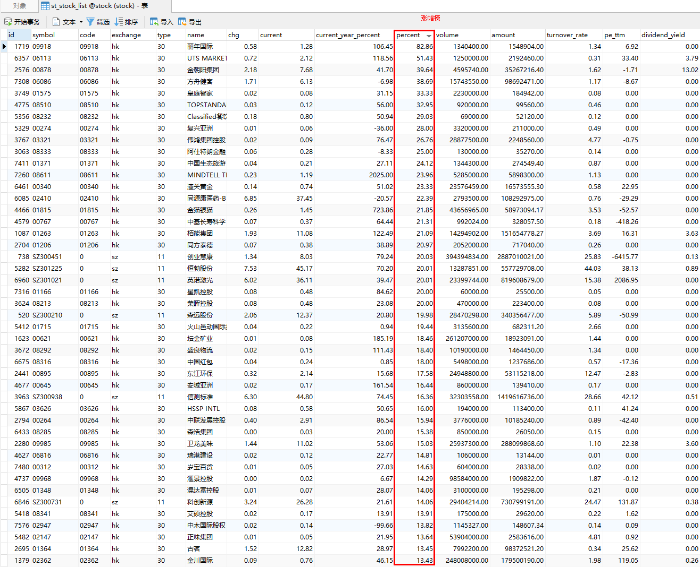

# KLineX

KLineX股票分析系统

使用 laravel 11 开发




## 开发计划

#### 2024 搭好框架与数据库

    ...数据采集与入库

#### 2025 做完基本的分析与模拟交易

    ...
    2025-03 数据分表,10分钟级数据  
    2025-04 web前端可视化页面
    2025-04-19 重命名为: KLineX
    2025-05 模拟交易
    2025-06 虚拟股票
    ...编写中

#### 2026 模拟交易APP

    ...

## 要求

1. php >= 8.4
2. composer 2.x
3. mysql >= 8.4

## 安装

安装所需要的包
```
php composer.phar install
```
初始化数据库
```
php artisan migrate
```

## http服务

```
php artisan serve --port=8018 --host=0.0.0.0
```

[http://127.0.0.1:8018](http://127.0.0.1:8018)


## 任务调度

其中包括股票数据更新等

```
php artisan schedule
```


## docker

无需学习语言,环境即可使用,运行后无需维护数据库,定时任务,队列等服务

#### 使用 docker-compose 一健部署

```
cd docker && docker-compose up -d
```
等待 ```N``` 秒后即可访问 [http://127.0.0.1:8018](http://127.0.0.1:8018)

## 说明

本程序仅供学习交流使用，请勿用于商业用途。   
本程序依懒于 [某球] api，如果api失效，可以联系作者更换api。

## 参与

1. fork 当前库到你的名下。
2. 在你的本地修改完成审阅过后提交到你的仓库。
3. 提交 PR 并描述你的修改，等待合并。

## License

[MIT license](https://opensource.org/licenses/MIT)
